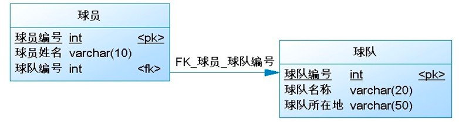
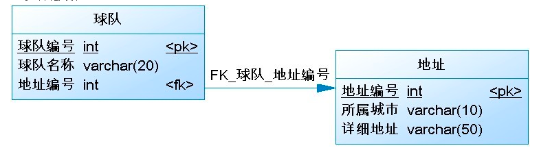
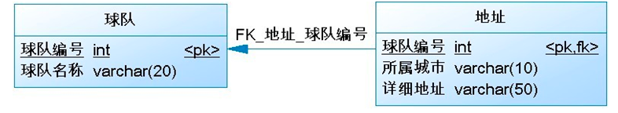
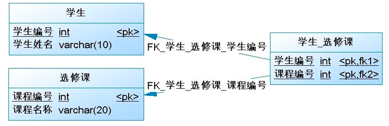

# 数据库设计
数据库建表-- 一对多/多对一/一对一/多对多 关系

关联映射：一对多/多对一
一对多关系，简单来讲就如球员与球队的关系；
从球队角度来说一个球队拥有多个球员 即为一对多多对一： 从球员角度来说多个球员属于一个球队 即为多对一。
一对多关系如下图：

注：一对多/多对一关系简记：“多”的要记住“一”的主键，即每个球员表都要通过外键来记住球队表。

关联映射：一对一
关系就如球队与球队所在地址之间的关系，一支球队仅有一个地址，而一个地址区也仅有一支球队。
数据表间一对一关系的表现有两种，一种是外键关联，一种是主键关联。图示如下：

一对一外键关联：

一对一主键关联：要求两个表的主键必须完全一致，通过两个表的主键建立关联关系

关联映射：多对多

多对多关系也很常见，例如学生与选修课之间的关系，一个学生可以选择多门选修课，而每个选修课又可以被多名学生选择。 
数据库中的多对多关联关系一般需采用中间表的方式处理，将多对多转化为两个一对多。

多对多关系如下图：

----------------------------------------------------------------------------------------------------------

前言：多对多关系至少需要3个表，我们把一个表叫做主表，一个叫做关系表，另外一个叫做字典表或者副表（字典表是纪录比较少，而且基本稳定的，例如：版块名称；副表是内容比较多，内容变化的，例如）。
按照数据库的增删查改操作，多对多关系的查找都可以用inner join或者

select * from 主表 where id in (select 主表id from 关系表)

1，角色任命型

特点：关系表两外键组合无重复纪录，关系表一般不需要时间字段和主键，有一个表是字典类型的表。
界面特点：显示主表，用checkbox或多选select设置多选关系。
例如：任命版主（用户表-关系表-版块名称表），角色权限控制等，用户是5个版块版主，只要关系表5行纪录就可以确立，关系表的两个外键具有联合主键性质。
增加关系：如果没有组合纪录，insert之。
删除关系：如果有组合纪录，删除之。

2，集合分组型

特点：同角色任命型类似，关系表两外键组合无重复纪录，关系表一般不需要时间字段和主键。区别是主副表都不是字典表，可能都很大不固定。
界面特点：显示主表，用搜索代替简单的checkbox或多选select，或者一条一条的添加。
例如：歌曲专集（专集表-关系表-歌曲表）。手机分组（分组表-关系表-手机表）。用户圈子（圈子表-关系表-用户表）。文章标签（文章表-关系表-标签表）
增加关系：同版主任命型。
删除关系：同版主任命型。

3，明细帐型

特点：关系表可以有重复纪录，关系表一般有时间字段，有主键，可能还有文字型的字段用来说明每次发生关系的原因（消费）。
界面特点：显示关系表，用radio或下拉设置单选关系。
例如：现金消费明细帐或订单（用户表-订单表-消费原因表），用户可能多次在同一事情上重复消费。积分变化纪录也属于这类。
增加关系：不管有没有组合纪录，insert之，纪录时间。
删除关系：根据关系表PK删除。

4，评论回复型

特点：同明细帐型关系表一般有时间字段，有主键，区别是重点在文字型的字段用来说明每次发生关系的内容（评论回复）。
界面特点：回复文本框。
例如：论坛回复（用户表-回复表-帖子表），用户可能多次在不同帖子上评论回复费。
增加关系：不管有没有组合纪录，insert之，纪录时间和文字。
删除关系：根据关系表（回复表）PK删除。

5，站内短信型

特点：主副表是同一个，关系表一般有时间字段，有主键，重点在关系表文字型的字段用来说明每次发生关系的内容（消息）或者其他标记位来表示文字已读状态时间等。
界面特点：回复文本框。
例如：站内短信（用户表-短信表-用户表），用户可能给用户群发或者单发，有标记位来表示文字已读状态时间等。
增加关系：不管有没有组合纪录，insert之，纪录时间和文字。
删除关系：根据关系表（回复表）PK删除。

6，用户好友型

特点：主副表是同一个，同集合分组型，关系表两外键组合无重复纪录，关系表一般不需要时间字段和主键。
界面特点：同集合分组型，显示主表，用搜索代替简单的checkbox或多选select，或者一条一条的添加。
例如：下载站点的文件，（文件表-关系表-文件表）可以被软件工具打开，软件工具本身也是一种文件，可以被下载。用户的好友，也是用户（用户表-好友关系表-用户表）
增加关系：同版主任命型。
删除关系：同版主任命型。

7，未知属性型

特点：在设计初期，主表的某些字段类型和名称是不确定的时候，关系表实际上是主表的可扩展字段，
一个[主表]（ID），
一个[属性名称表]（属性ID.属性名称)，
一个[属性值表]，包括3个字段：
属性值(属性Value varchar(500))
主表ID
属性ID

这样可以作到最小冗余度。
（和常见的多对多关系不同的是：值统一用varchar来存储，因为这类型的值一般不会用来计算）。

比如：

军队的数据库设计中有种物资叫做“战缴物资”，就是打仗的时候缴获的，军队自己都不知道这些物资有什么属性。

比如缴获的化学品有化学名，通用名，是否有辐射，计量单位，包装规格，数量等等，或者不是化学品是其他任何未知的东西。
这样东西就可以

某奇怪东西.属性集合["某某奇怪属性名"]="某某奇怪值"；    
某变态东西.属性集合["某某变态属性名"]="某某变态值"；

这样存储。

再比如：

手机型号有几千种，除了共同属性外还有不同属性有几百个，属性名和值类型都不一样，有的手机有这属性，有的没有。
对于这样的“多态”，我们就采用上面的设计结构。
其效果相当于：

某奇怪手机.属性集合["某某奇怪属性名"]="某某奇怪值"；
某变态手机.属性集合["某某变态属性名"]="某某变态值"；

界面特点：设置主表一行纪录的属性时候，要列出所有可能的属性名称，每个对应一个文本框。

NULL、RESTRICT、NO ACTION
删除：从表记录不存在时，主表才可以删除。删除从表，主表不变
更新：从表记录不存在时，主表才可以更新。更新从表，主表不变

CASCADE
删除：删除主表时自动删除从表。删除从表，主表不变
更新：更新主表时自动更新从表。更新从表，主表不变

SET NULL
删除：删除主表时自动更新从表值为NULL。删除从表，主表不变
更新：更新主表时自动更新从表值为NULL。更新从表，主表不变

定义：如果一个A表的字段指向B表的主键，则此字段就位A表的外键。用于表示表之间的关系。
存在外键的表，称之为从表，外键指向的表，称之为主表。

（1）restrict方式：同no action，都是立即检查外键约束；

         - - 限制，指的是如果子表引用父表的某个字段的值，那么不允许直接删除父表的该值。
（2）cascade方式：在父表上update/delete记录时，同步update/delete子表的匹配记录 ；

         On delete cascade从mysql3.23.50开始可用，on update cascade从mysql4.0.8开始可用 ；
         -- 级联，删除/更新父表的某条记录，子表中引用该值的记录会自动被删除/更新。
（3）No action方式：如果子表中有匹配的记录,则不允许对父表对应候选键进行update/delete操作 这个是ANSI SQL-92标准,从mysql4.0.8开始支持；

         --无参照完整性关系，有了也不生效。
（4）set null方式：在父表上update/delete记录时，将子表上匹配记录的列设为null 要注意子表的外键列不能为not null

ALTER TABLE `locker`.`t_license`
ADD COLUMN `uid` int NULL COMMENT '用户id' AFTER `remark`,
ADD INDEX `uid`(`uid`) USING BTREE,
ADD CONSTRAINT `t_license_ibfk_1` FOREIGN KEY (`uid`) REFERENCES `locker`.`t_user` (`id`) ON DELETE CASCADE ON UPDATE CASCADE;

一、sql的left join 、right join 、inner join之间的区别
https://www.cnblogs.com/assasion/p/7768931.html

left join(左联接) 返回包括左表中的所有记录和右表中联结字段相等的记录
right join(右联接) 返回包括右表中的所有记录和左表中联结字段相等的记录
inner join(等值连接) 只返回两个表中联结字段相等的行

